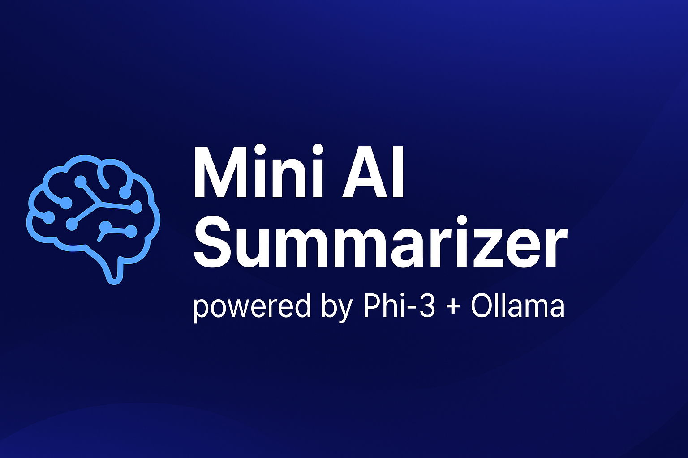

<p align="center">
  
</p>

<h1 align="center">🧠 Mini AI Summarizer</h1>
<h3 align="center">Powered by Phi-3 + Ollama | Offline AI Summarization Chrome Extension</h3>

<p align="center">
  <a href="https://nodejs.org/"></a>
  <a href="https://ollama.ai/"></a>
  <a href="https://chrome.google.com/"></a>
  <a href="https://github.com/yashrawat2362"></a>
</p>

---

## 🌟 Overview

**Mini AI Summarizer** is a lightweight Chrome Extension that extracts and summarizes the main content of any webpage using a **local Phi-3 model via Ollama** — ensuring privacy, speed, and full offline capability.  
It’s your personal offline **Comet-like** AI summarizer.  

---

## 🚀 Features

- 🧩 **One-click summarization** from any webpage  
- ⚙️ **Local AI (Phi-3 / Ollama)** – No API key or internet required  
- 🧼 **Smart text extraction** with DOM cleaner  
- ⚡ **Lightweight backend** built on Node.js + Express  
- 🧭 **Fully customizable** (e.g., change AI models, tweak prompts)

---

## 🗂️ Project Structure

ai-browser-prototype/
│
├── extension/
│ ├── manifest.json
│ ├── popup.html
│ ├── popup.js
│ ├── content.js
│ ├── style.css
│ └── icons/
│ ├── icon16.png
│ ├── icon48.png
│ └── icon128.png
│
├── server/
│ ├── server.js
│ ├── package.json
│ └── package-lock.json
│
└── README.md


---

## ⚙️ Setup Instructions

### **1️⃣ Prerequisites**
Make sure you have installed:
- [Node.js](https://nodejs.org/) (v18 or above)
- [Ollama](https://ollama.ai) (running locally)
- Google Chrome (for testing the extension)

---

### **2️⃣ Install and Run Ollama Model**

Pull and serve the **Phi-3** model:
```bash
ollama pull phi3


(Optional) You can use Llama3 or Gemma2 instead:

ollama pull llama3


Start Ollama:

ollama serve

### **3️⃣ Setup the Backend (Local Server)**

Go to your server directory:

cd server
npm install
node server.js


If successful, you’ll see:

✅ Local AI server running on http://localhost:5050

### **4️⃣ Setup Chrome Extension**

Open Google Chrome

Go to → chrome://extensions/

Enable Developer mode

Click Load unpacked

Select the extension/ folder

Pin the 🧠 Mini AI Summarizer icon to your toolbar

5️⃣ Test It Out

Open any article or blog

Click the 🧠 icon → “Summarize Page”

Wait a few seconds…

See your offline AI summary generated locally by Phi-3 🚀

🧩 Troubleshooting
Problem	Possible Fix
❌ Backend error: Unexpected token '<'	Ensure your server is running at http://localhost:5050
⚠️ PayloadTooLargeError	Increase limit: app.use(express.json({ limit: "5mb" }))
🚫 Could not establish connection	Reload the tab or re-enable the extension
🧱 model runner has unexpectedly stopped	Restart Ollama: killall ollama && ollama serve
🧠 Future Enhancements

💬 Add multi-mode AI panel (Summarize / Explain / Simplify / Ask)

🗂️ Store summary history locally

🔊 Add “Read Aloud” (TTS)

🎨 Sidebar UI (like Perplexity or Comet)

⚙️ Model switcher for Phi-3 / Llama3 / Gemma2

📜 License

MIT License © 2025 Yash Rawat

<p align="center"> <b>Made with ❤️ and Phi-3 by Yash Rawat</b> </p> ```